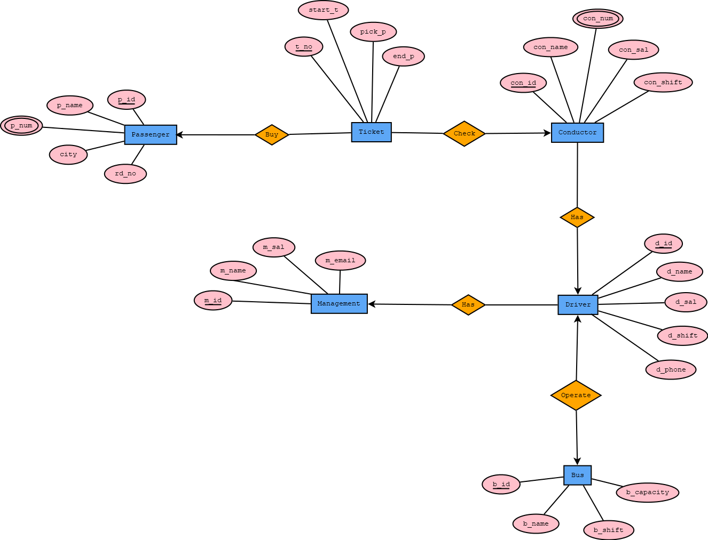

# 🚌 Bus Ticket Management System

## 📌 Overview
This project is a **Bus Ticket Management System** developed using **Oracle 10g**. It manages and organizes data related to passengers, tickets, drivers, conductors, buses, and management. The system provides an efficient way to store, retrieve, and handle transportation data. Its introduces 
an advance platform that effortlessly weaves together employee, 
passenger, ticket management, driver and other data. The following 
system help us to find our specific data. It’s like a helpful guide for 
exploring and utilizing data.  
The purpose of this project is to design and implement a project 
that stores and manage information about employees, passengers, 
drivers, conductor, route, bus and other relevant data. The system 
is designed to support a small-scale bus ticket management system 
with a potential for scalability in the future. 

---

## 🧩 ER Diagram

---

## 🔍 Entities & Relationships

### 🧑 Passenger
- Attributes: `p_id`, `p_name`, `p_num`, `city`, `rd_no`
- Relationship: Buys Ticket

### 🎫 Ticket
- Attributes: `t_no`, `start_t`, `pick_p`, `end_p`
- Relationships:
  - Purchased by Passenger
  - Checked by Conductor

### 👮 Conductor
- Attributes: `con_id`, `con_name`, `con_num`, `con_sal`, `con_shift`
- Relationships:
  - Checks Ticket
  - Works with Driver

### 🚗 Driver
- Attributes: `d_id`, `d_name`, `d_phone`, `d_sal`, `d_shift`
- Relationships:
  - Operates Bus
  - Managed by Management

### 🚌 Bus
- Attributes: `b_id`, `b_name`, `b_capacity`, `b_shift`
- Relationship: Operated by Driver

### 🏢 Management
- Attributes: `m_id`, `m_name`, `m_email`, `m_sal`
- Relationship: Manages Driver

---

## ⚙️ Features
- Passenger management
- Ticket booking and tracking
- Driver & conductor management
- Bus and route handling
- Structured relational database design
- Easy data retrieval using SQL

---

## 🛠️ Technologies Used
- **Oracle 10g**
- **SQL

